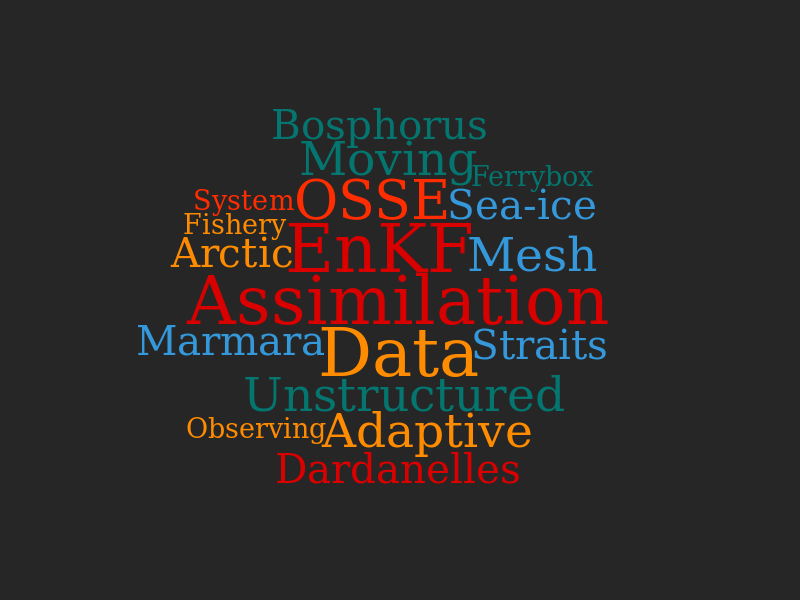

{:height="200px" width="640px"}

A list of publications which I have contributed can be found **[here](/about/publication)**

A list of scientific activities which I'm involved can be found **[here](/calendar/index)**

**Languages**

Turkish, English, Italian

**Education**

- Ph.D. Science and Management of Climate Change (Feb 2017) **Advanced Modeling and Data Assimilation Methods for the Design of Sustained Marine Monitoring Networks**. [Universita Ca' Foscari Venezia](https://unive.it) & [CMCC](https://cmcc.it). Supervisor: Nadia Pinardi

- M.S. Physical Oceanography (Jul 2012) **A Coupled Modelling Attempt of Hydrodynamics and Ecosystem of the Northern Levantine Basin**. Institute of Marine Sciences, [METU](https://metu.edu.tr). Supervisor: Emin Özsoy

- B.S. Mathematics (Jun 2009) Middle East Technical University

**Research Experience**

- Post Doctoral Researcher at NERSC (Jun 2017 - present)
- Post Doctoral Researcher at CMCC (Sep 2016 - Jun 2017)
- Visiting Researcher at NCAR - Boulder (Apr 2016 - Jun 2016)
- Visiting Researcher at CMCC OceanLab - Lecce (Oct 2015 - Feb 2016)
- Research Assistant at CMCC JERICO project (2013)
- Research Assistant at IMS-METU MyOcean II project (2012-2013)
- Research Assistant at IMS-METU SESAME project (2011-2012)
- Research Assistant at IMS-METU MyOcean project (2009-2011)

**Programming Skills**

- Scripting on Linux/Unix Environments
- Scientific Programming: Fortran, Python, Matlab
- Parallel Computing: openmp, mpi
- Data analysis and visualization: [Matlab](https://www.mathworks.com),
  [PyFerret](https://ferret.pmel.noaa.gov/Ferret/documentation/pyferret),
[GMT](http://gmt.soest.hawaii.edu)

**Research Tools**

- Regional Ocean Modeling System ([ROMS](https://www.myroms.org))
- Nucleus for European Modelling of the Ocean ([NEMO](https://www.nemo-ocean.eu))
- Finite Element Sea-Ice Ocean Model ([FESOM](https://fesom.de))
- Data Assimilation Research Testbed ([DART](http://www.image.ucar.edu/DAReS/DART))
- neXt Generation Sea Ice Model ([neXtSIM](https://www.nersc.no/group/sea-ice-modelling]))

**Field Research**

- 2010 - Seven days of field study in the Turkish Straits System with R/V Bilim2
- 2010 - Three days of field study in the Gulf of Mersin with R/V Bilim2
- 2009 - Seven days of field study along Turkish coasts of the Aegean Sea and the Mediterranean with R/V Bilim2

