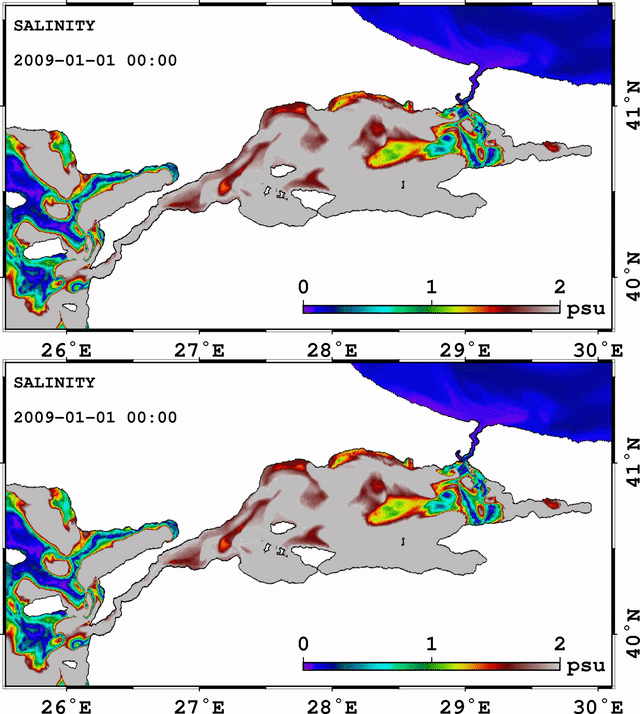

{:height="150px" width="640px"}

This website serves me to keep track of my research and related activities. It
is still underdevelopment. You can reach some of my public profiles in social
media related to research using the links at the [home page](/index). You can
find my current publication list [here](/about/publication).

{:height="714px" width="640px"}
*This movie shows the error reduction in the salinity RMS of differences at the first 50 m after assimilation (bottom) of synthetic ferrybox observations compared to assimilation-free simulation (top) between Jan 1, 2009 and Jan 8, 2009*
