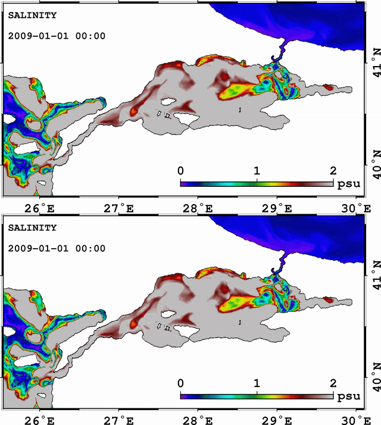

STILL UNDER CONSTRUCTION !

{:height="714px" width="640px"}
*This movie shows the error reduction in the salinity RMS of differences at the first 50 m after assimilation (bottom) of synthetic ferrybox observations compared to assimilation-free simulation (top) between Jan 1, 2009 and Jan 8, 2009*

<ul>
  
    <li>
      <a href="{{ post.url }}">{{ post.title }}</a>
    </li>
  
</ul>

<!---
<iframe width="100%" height="120" scrolling="no" frameborder="no" src="https://w.soundcloud.com/player/?url=https%3A//api.soundcloud.com/tracks/113787209&amp;auto_play=false&amp;hide_related=false&amp;show_comments=true&amp;show_user=true&amp;show_reposts=false&amp;visual=true"></iframe>
-->
