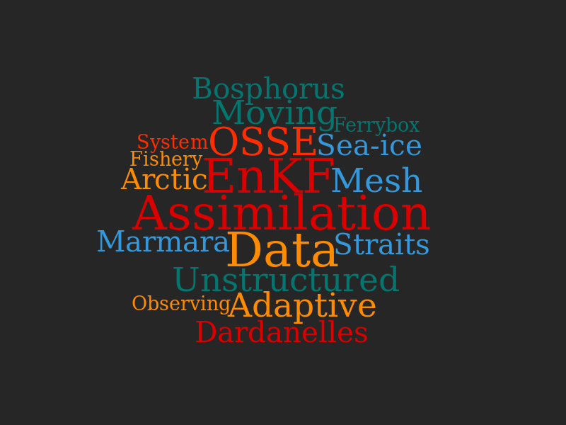

{:height="300px" width="100%"}

A list of publications which I have contributed can be found <a href="/research/publication">here  </a>

A list of scientific activities which I'm involved can be found <a href="/calendar/index">here</a>

**Research Experience**

|                      |       |                      |                     |
|----------------------|:------|:---------------------|---------------------|
| Research  Scientist  | @CMCC | (Sep 2019 - present) ||
| Visiting             | @NCAR | (Aug 2019)           ||
| PostDoc              | @NERSC| (Jun 2017 - Jul 2019)||
| PostDoc              | @CMCC | (Sep 2016 - Jun 2017)||
| Visiting             | @NCAR | (Apr 2016 - Jun 2016)||
| Visiting             | @CMCC | (Oct 2015 - Feb 2016)| OceanLab - Lecce|
| Research Assistant   | @CMCC | (Mar 2013 - Sep 2013)| JERICO project|
| Research Assistant   | @METU | (Sep 2012 - Feb 2013)| MyOcean II project|
| Research Assistant   | @METU | (Sep 2011 - Sep 2012)| SESAME project|
| Research Assistant   | @METU | (Sep 2009 - Sep 2011)| MyOcean project|

**Education**

- Ph.D. Science and Management of Climate Change (Feb 2017) **Advanced Modeling and Data Assimilation Methods for the Design of Sustained Marine Monitoring Networks**. [Universita Ca' Foscari Venezia](https://unive.it) & [CMCC](https://cmcc.it). Supervisor: Nadia Pinardi

- M.S. Physical Oceanography (Jul 2012) **A Coupled Modelling Attempt of Hydrodynamics and Ecosystem of the Northern Levantine Basin**. Institute of Marine Sciences, [METU](https://metu.edu.tr). Supervisor: Emin Özsoy

- B.S. Mathematics (Jun 2009) Middle East Technical University

**Computing**

- Scripting on Linux/Unix Environments
- Scientific Programming: Fortran, C\+\+, Python, Matlab
- Parallel Computing: openmp, mpi
- Data analysis and visualization: [Matlab](https://www.mathworks.com),
  [PyFerret](https://ferret.pmel.noaa.gov/Ferret/documentation/pyferret),
[GMT](http://gmt.soest.hawaii.edu)

**Research Tools**

- Regional Ocean Modeling System ([ROMS](https://www.myroms.org))
- Nucleus for European Modelling of the Ocean ([NEMO](https://www.nemo-ocean.eu))
- Finite Element Sea-Ice Ocean Model ([FESOM](https://fesom.de))
- Data Assimilation Research Testbed ([DART](http://www.image.ucar.edu/DAReS/DART))
- DAPPER ([DAPPER](https://github.com/nansencenter/DAPPER))
- neXt Generation Sea Ice Model ([neXtSIM](https://www.nersc.no/group/sea-ice-modelling))

**Field Research**

- 2010 - Seven days of field study in the Turkish Straits System with R/V Bilim2
- 2010 - Three days of field study in the Gulf of Mersin with R/V Bilim2
- 2009 - Seven days of field study along Turkish coasts of the Aegean Sea and the Mediterranean with R/V Bilim2
